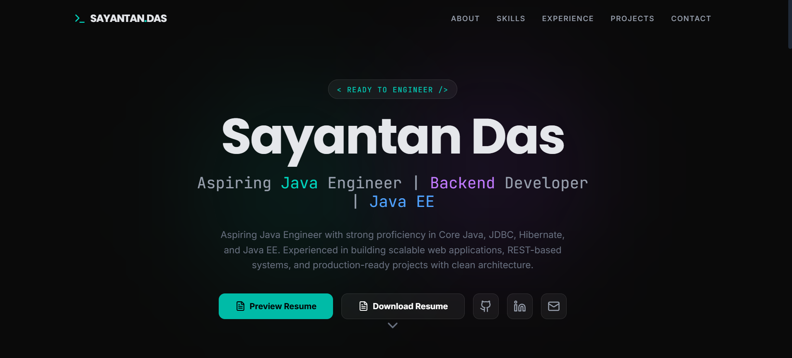

# 🚀 Sayantan Das — Java Engineer Portfolio

<p align="center">
  
</p>


## 👋 Overview

Welcome to my personal **developer portfolio website**.  
This portfolio is designed to showcase my **skills, projects, and experience** as an **Aspiring Java Engineer & Backend Developer** with a strong foundation in **Core Java, JDBC, Hibernate, and Java EE**.

The website follows **modern UI/UX standards**, a **dark developer theme**, smooth animations, and a **recruiter-friendly layout**.

---

## 🧑‍💻 About Me

I am a **B.Tech Computer Science & Engineering student** with a passion for building **scalable backend systems and clean web applications**.  
I focus on writing **maintainable, efficient, and production-ready code** while continuously improving my problem-solving and system design skills.

---

## 🛠️ Tech Stack

### Languages & Backend
- Java (Core Java)
- Java EE (JSP, Servlets)
- JDBC
- Hibernate
- Python
- C

### Frontend
- HTML
- CSS
- JavaScript

### Tools & Platforms
- Git & GitHub
- VS Code
- Eclipse
- WordPress
- Cloud Hosting

---

## 📊 Features

- 🌙 Dark theme developer UI  
- 🎯 Clear hero section with professional summary  
- 📈 Skill visualization using charts & graphs  
- 💼 Experience timeline  
- 🚀 Project showcase with live demos  
- 📄 Resume preview & download  
- 🔗 Social links (GitHub, LinkedIn, Email)  
- 📱 Fully responsive design  
- ✨ Smooth animations and transitions  

---

## 🧩 Projects Showcased

- **Fully Functional E-Commerce Website**  
  Live: https://creativeindiastore.in/

- **Bahurupi Bangla – Travel Guide Website**  
  Live: https://codecrafterse.github.io/CodeCrafters_5/

- **Placement Information System (Static Web App)**  
  Live: https://innovtiveproject.github.io/placementinformation/

---

## 📂 Website Sections

- Home (Hero)
- About Me
- Skills (with charts)
- Experience
- Projects
- Contact

---

## 📄 Resume

The portfolio includes:
- Resume preview modal
- One-click resume download

---

## 📬 Contact

Feel free to reach out for:
- Internship opportunities
- Full-time roles
- Freelance projects
- Collaboration

📧 Email: sayantandas20045@gmail.com  
🔗 LinkedIn: https://linkedin.com/in/sayantan-das07  

---

## ⚡ Getting Started (Optional for Developers)

```bash
git clone https://github.com/your-username/your-portfolio-repo.git
cd your-portfolio-repo
npm install
npm run dev


